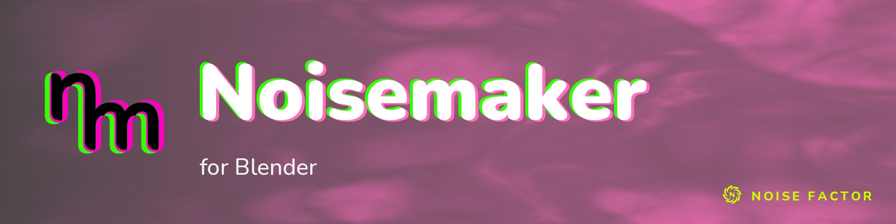

<!-- repo-hero -->
<a href="https://noisemaker.app/"></a>

<sub>Open source from <a href="https://noisefactor.io">Noise Factor</a> &middot; <a href="https://github.com/noisefactorllc">more projects</a></sub>

# Noisemaker for Blender

Measured support is recorded on the [compatibility report](https://github.com/noisefactorllc/noisemaker-for-blender/issues/7);
open gaps are the [issues labelled `gap`](https://github.com/noisefactorllc/noisemaker-for-blender/issues?q=is%3Aissue+label%3Agap).

> Run **Noisemaker**'s procedural visuals inside **Blender**.

> This package supports the "Export Shader Pipeline" feature in Noisedeck.app. The
> feature runs shader compositions on other platforms. Noise Factor derives this package
> from the upstream Noisemaker Engine project and tests it for pixel-level parity.

## What is this?

**Noisemaker** is a procedural visual engine. You write tiny text programs — chains of
effects — and it renders live, animated GPU images:

```
search synth, filter
noise(scaleX: 60).bloom().write(o0)
render(o0)
```

That little language is Noisemaker's **DSL** (a domain-specific language for visuals). The original
engine runs in the browser at [noisedeck.app](https://noisedeck.app).

**Noisemaker for Blender** runs that same engine *inside Blender*: the same programs and the same
effects (all but the two audio-input ones), rendered on Blender's GPU. Use it to make textures, materials, and animated backgrounds
from code, with no image files.

The add-on evaluates programs in persistent GPU sessions and publishes floating-point Blender
**Images**. The **Live** panel updates an Image while you edit a Text datablock or typed parameters;
stock material, world, compositor and Geometry Nodes image consumers use that Image. The original
square **Bake** workflow remains available.

**Automatic final rendering is not qualified.** F12 and Blender's built-in animation operator do
not refresh live output. Use the explicit scripted rendering API described below. See the
[implementation status](docs/REALTIME-INTEGRATION-PLAN.md#9-implementation-status) for measured
results and remaining acceptance gates.

It is **self-contained**: the addon compiles the DSL and renders it entirely in Blender — no
internet, no Node.js, no separate engine to install.

## What you can do with it

- **Generate animated textures** from a short program — noise, gradients, patterns, color grades,
  blurs, warps.
- **Run simulations on the GPU** — particle/agent systems (flocking, slime/physarum, diffusion),
  fluid (navier–stokes), and 3D volume renders.
- **Use the result anywhere an Image goes** — materials, shader nodes, texture slots, and the
  compositor.
- **Author, preview and bake without leaving Blender** — from the sidebar of the Compositor / Image Editor,
  or from a node in the Noisemaker node editor.

## Requirements

- **Blender 5.1** (uses its bundled **Python 3.13**).
- A **GPU and an open window.** Baking uses Blender's `gpu` module, which needs a real graphics
  context — so it runs in an interactive session, not `--background` (see [Good to know](#good-to-know)).
- Verified on **Apple Silicon / Metal**. Windows is not supported yet.

## Install

The addon is a classic single-folder addon, so install it as a zip:

```sh
cd blender && zip -r noisemaker_blender.zip noisemaker_blender -x '*/__pycache__/*' '*.pyc'
```

Then in Blender:

1. Open **Edit ▸ Preferences ▸ Add-ons ▸ Install from Disk**.
2. Select `noisemaker_blender.zip`.
3. Enable **"Noisemaker for Blender"**.

For development, add the checkout's `blender/` directory to Python's import path in a disposable
Blender session and call `noisemaker_blender.register()`.

### Versions and notices

The zip (and the add-on folder) carries its MIT notice as `noisemaker_blender/LICENSE.txt`. The
add-on's own version is `bl_info`'s `version` tuple, visible in **Preferences ▸ Add-ons**. The
published Noisedeck kit's version (`0.1.N`) is a separate kit-publication counter — not the add-on
version. Each published kit's `kit.json` records the exact source revision it was built from
(`source.sha`), which binds a kit version to the add-on version it contains. Bump the add-on's
patch version in the same change that alters the distributed add-on; never reuse a version.

## Your first render

1. **Write a program** in Blender's **Text Editor**:
   ```
   search synth, filter
   noise(seed: 1, scaleX: 50, scaleY: 50).adjust().write(o0)
   render(o0)
   ```
2. **Open the Noisemaker panel.** Press `N` in the **Compositor** or **Image Editor**.
   Open the **Noisemaker** tab. Select your text block.
   Alternatively, add a *Program* node in the **Noisemaker** node editor with Shift+A. Set its DSL there.
3. For interactive editing, add an instance with **+** in the **Live** panel, select the Text
   datablock and enable **Live**. Choose its output Image in the Image Editor. **Pause** retains
   the last frame; **Reset** restarts simulation state. **Bake** remains a separate one-shot path.
4. **Use it** — add an **Image node** in the compositor pointing at that datablock, or drop the Image
   into any material or texture.

**Every DSL program** has the same shape:

- Name the namespaces it uses (`search synth, filter`).
- Chain the effects.
- Write the result to an output surface (`.write(o0)`).
- Select a surface to show (`render(o0)`).

Ready-to-bake examples live in [`parity/programs/`](parity/programs). The flagship is
[`parity/programs/north_star.dsl`](parity/programs/north_star.dsl): 3D noise → chaotic particle
flow → fluid → color, lighting, bloom and lens. Its chaotic flow → fluid chain is a different
instance of the same chaos on each engine, so it does not match the reference pixel for pixel (see
[docs/CHAOS-GATE.md](docs/CHAOS-GATE.md)).

## Good to know

- **Baking is GUI-only on macOS.** Blender can't draw on the GPU under `--background` on macOS, so a
  window has to be open for fresh GPU evaluation. Background Blender can consume an already
  prepared binary float cache; it is not a fresh Noisemaker GPU rendering path. Other platforms
  require independent qualification.
- **Live/session output can be rectangular.** Set independent preview width and height; final
  rendering uses the scene resolution or explicit instance render dimensions. Legacy Bake keeps
  its square `size × size` API.
- **Audio effects are out of scope** — `scope` and `spectrum` (MIDI / audio input) aren't ported.
  Other effects retain their existing port contracts and parity scope. Time-based animation still works.
- **Simulations need time to evolve.** Fluid, agent sims, reaction-diffusion, and cellular automata
  start from nothing, so a single frame looks empty. Raise **Frames** to ~**1800** and set
  **Timestep** ≈ **`0.00167`** (1/600). The runtime advances normalized simulation time by one
  timestep per frame and wraps it at 1, so 1800 frames step the simulation by ≈ 3.0 normalized
  time units — there is no seconds conversion. Plain still effects want the
  defaults (Frames = 1, Timestep = 0). Long GUI bakes run modally and can be canceled.
  Live sessions use scene seconds and fixed simulation steps instead of the legacy bake timestep.
  Stateful seeks replay from the origin in bounded preview batches and retain the last complete
  Image until replay finishes. Animated stateful parameter histories require explicit snapshots;
  unsupported histories fail rather than reuse target-frame values.

## Use it in your own Blender project

A bake produces an ordinary Blender **Image** datablock, so it works anywhere a texture does:

- an **Image** node in the compositor,
- an **Image Texture** node in a material or shader,
- any panel that takes an image.

Legacy Bake retains its quantized **Non-Color** Image output for compatibility. Live/session
publication preserves floating-point values, including HDR and negative values: color output uses
**Linear Rec.709**, data/normal output uses **Non-Color**, and the default alpha mode is
**Premultiplied**. Display transforms belong to Blender's display/output boundary.

### Python sessions and final rendering

The public facade imports without an active editor. GPU evaluation still needs a real Blender
window context; the live timer and explicit preparation path provide the tested execution points.

```python
from noisemaker_blender import api as nm

program = nm.compile("search synth\nnoise(seed: 1).write(o0)\nrender(o0)")
instance = nm.create_instance(scene, program, name="Clouds")
nm.set_parameter(instance, "noise#0.seed", 7)
with nm.open_session(instance, width=1024, height=512) as session:
    output = session.evaluate(nm.FrameRequest(frame=scene.frame_current,
                                              subframe=scene.frame_subframe,
                                              fps=scene.render.fps,
                                              fps_base=scene.render.fps_base))
    image = session.publish_image(output, name="Clouds")
    texture = nm.attach_material(instance, material, image)
```

A borrowed `OutputHandle` expires on the next evaluation or session replacement/close. Use
`session.read_float(output)` for an owned top-down float array. Consumer helpers create/reuse
stock Image nodes; connect their sockets to the intended shader/compositor/geometry output.
Instance sessions require the request frame/subframe/FPS to match the current Scene and refresh
evaluated parameters on every evaluation. Use a plain Program session for explicit independent
time requests and exact-frame snapshot providers.

For bounded stateful replay with animated scalar parameters,
`nm.prepare_parameter_snapshots(instance, request, max_steps=64)` captures evaluated values
through the requested fixed simulation step and restores the Scene time. Pass that result to
`nm.open_session(prepared, width=..., height=...)`. It freezes the Program and parameter history;
subsequent Scene edits require a new capture. It does not bind live inputs or authorize current
instance/final-cache freshness. Capture is limited to 256 steps and rejects animated defines,
resource dimensions or parameters that select render passes.

`nm.render_animation(scene, first, last)` prepares and publishes each exact frame before the
scene renderer runs. Cycles Persistent Data uses prepared float EXR sequences during that render
scope and restores the original Image nodes afterward. Prepared rendering currently rejects
same-scene dependent live instances; those use the fresh scripted path with Persistent Data off. `nm.prepare_render(scene, frames,
policy=nm.RenderPolicy(cache_directory=directory))` returns a `PreparedRender`; retain its entries
and directory with the saved scene. `nm.render_prepared(scene, prepared, frames=frames)` verifies
current source, parameters, inputs and timing against those entries and consumes the binary cache
without creating a GPU session, including in background Blender. Missing/stale entries fail before
the affected frame reaches the scene renderer. Motion blur requiring multiple procedural states
remains unqualified and is rejected.

Use **Pack Output on Save** to preserve the latest generated Image in a `.blend`. DSL, stable
instance IDs, typed/keyed parameters and Image input references persist; GPU handles do not.
Movie/sequence inputs require an exact-frame provider. Audio/MIDI snapshots can drive existing
automation through the session API; device capture and `scope`/`spectrum` remain outside this port.

## What works today

- **Catalog.** 210 effect definitions in 8 namespaces, transpiled into 309 shader programs. The two
  audio programs, `scope` and `spectrum`, are out of scope; every other program is built.
- **Compiler.** The add-on's Python compiler produces the same render graph as the reference
  compiler for every program in `parity/corpus/` (the compiler gates in `scripts/test`; `B5oBsA`, a
  program that must fail to compile, is excluded from the expand and graph gates).
- **Rendered parity.** `scripts/parity-summary` renders the 116 cases listed in
  `parity/3d-expected.txt` and `parity/artistic-expected.txt` with this add-on and with the
  reference WebGL2 engine at the pinned revision (headless Chromium, ANGLE over Metal), at
  256×256, time 0.25, 8 frames. The goldens are minted on the GPU class the add-on renders on, never
  on SwiftShader ([platform notes](docs/BLENDER-PLATFORM-NOTES.md#6-parity-expectation)). Each case grades exact (identical), strict (every channel within
  2/255, SSIM ≥ 0.98), near (inside a measured entry of the near policies in `parity/`), or fail.
  The latest counts and per-case results are on the compatibility report; this README carries no
  copy of them.
- **Chaotic programs.** Chaotic agent flows that feed the fluid solver, and continuous cellular
  automata, render deterministically and stay bounded, but they are not graded for pixel parity
  ([docs/CHAOS-GATE.md](docs/CHAOS-GATE.md)).
- **Authoring.** Programs compile, preview and bake inside Blender. Live integration qualification
  is tracked separately from the historical rendered parity contract.

Platform details: **[docs/BLENDER-PLATFORM-NOTES.md](docs/BLENDER-PLATFORM-NOTES.md)**.

## How it works

Noisemaker turns a DSL program into a **render graph** — a normalized list of GPU passes. That graph
is the shared seam every Noisemaker port targets. Noisemaker for Blender ports the whole compiler to
Python (so it runs in-engine) and executes the graph on Blender's `gpu` module. Effect shaders are
translated mechanically from the reference GLSL into the form Blender's Metal backend requires, and
the final image is written to an Image datablock — which is what lets the stock compositor and
material nodes consume it.

→ **[ARCHITECTURE.md](ARCHITECTURE.md)** (how it maps onto Blender) ·
**[PORTING-GUIDE.md](PORTING-GUIDE.md)** (porting a shader) ·
**[docs/GRAPH-JSON-SCHEMA.md](docs/GRAPH-JSON-SCHEMA.md)** (the graph contract).

## Contributing

The add-on needs nothing external. The development tools compare it with the reference engine, so
they need `NM_REFERENCE_ROOT` set to a `noisemaker` checkout at the revision pinned in
`parity/reference-revision` (never vendored; `scripts/test` clones its own).

```sh
scripts/test                       # unit tests, PNG decoder, compiler gates (no Blender, no GPU)
NM_BLENDER=<blender> NM_GOLDEN_AUTO=1 NM_REFERENCE_ROOT=<reference at the pin> \
  NM_CHROME=<chromium> scripts/parity-summary [case ...]    # rendered parity (GPU + window)
NM_BLENDER=<blender> NM_GRADE_PY=<blender-python> bash parity/integration.sh   # DSL → bake → Image
```

Porting rules and how to add an effect or move the pin: **[PORTING-GUIDE.md](PORTING-GUIDE.md)**.
Contributions follow the Noise Factor
**[contributing policy](https://github.com/noisefactorllc/.github/blob/main/CONTRIBUTING.md)** and
**[Code of Conduct](https://github.com/noisefactorllc/.github/blob/main/CODE_OF_CONDUCT.md)**.

## Repo layout

```
blender/noisemaker_blender/   the add-on — zip and install this (backend, runtime, shaders, effects, compiler, node tree, UI)
blender/harness/              Blender-side render, test and diagnostic scripts
parity/                       parity manifests, near policies, fixtures, compiler gates, unit tests, reference pin
scripts/                      test and parity-summary entry points
tools/                        Node tooling: reference graph export, shader and definition conversion
reference/                    engine specs shared by all Noisemaker ports
docs/                         platform notes, chaos gate, graph schema
```

## License

MIT (see [LICENSE](LICENSE)). Use of the Noisemaker and Noise Factor names in derivative products is
subject to the [Trademark Policy](TRADEMARK.md).

Copyright © 2026 Noise Factor LLC
